@title[An introduction into Chocolatey]

### An introduction into Chocolatey

- Gary Ewan Park (Chocolatey)
- Maurice Kevenaar

---
@snap[h1-black]
# Questions @fa[question]
@snapend

@snap[h3-black]
### Just ask!
@snapend

---?color=#7FDBFF
@title[Who is Gary]

@snap[north-west]
Gary, Gary, Who the f****** is Gary?
@snapend
@snap[west span-65]
Senior Software Engineer @ Chocolatey Software
 
 

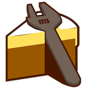
 
 
Gary is with us using Skype, live from Aberdeen, UK
@snapend

@snap[east span-30]

 

Gary Ewan Park

@snapend

@snap[south-west bio-contact]
@fa[twitter twitter-blue]&nbsp;&nbsp;@gep13&nbsp;&nbsp;&nbsp;
@fa[github text-black]&nbsp;&nbsp;github.com/gep13&nbsp;&nbsp;&nbsp;
@fa[home text-blue]&nbsp;&nbsp;gep13.co.uk&nbsp;&nbsp;&nbsp;
@fa[envelope choco-blue]&nbsp;&nbsp;gary@chocolatey.io
@snapend

---
@title[About Maurice]

@snap[north-west]
What do I do for Chocolatey?
@snapend

@snap[west span-65]
@ul
- Package Maintainer
  - WinRAR
  - Wireshark
  - Bitvise SSH Server
  - MariaDB / MySQL (workbench)
  - and many more (90+ in total)
- Package Moderator
- Contributor
@ulend
@snapend

@snap[east span-35]

 

Maurice Kevenaar

@snapend

---?image=assets/img/bg/black.jpg&position=left&size=35% 100%
@title[What is Immutable Infrastructure?]

@snap[west h4-white]
#### Question
@snapend

@snap[east span-80]
#### What is
## @css[text-gold text-bold](Chocolatey )@fa[question]
@snapend

+++?image=assets/img/bg/blue.jpg&position=left&size=35% 100%
@title[Immutable Infrastructure]

@snap[west h4-white]
#### Answer
@snapend

@snap[east span-70]
@quote[Chocolatey is a global PowerShell execution engine using the NuGet packaging infrastructure. Think of it as the ultimate automation tool for Windows.] - (Chocolatey Website)"
@snapend

+++

@title[It's Magic!]

---

@title[Windows Software Ecosystem]

## Windows Software Ecosystem

+++

@title[Traditional Windows]

### Traditionally Windows was designed with Visual Interfaces in mind

+++

@title[Still evident]

### There is no place more evident of that still than in the Windows Software Installer ecosystem

+++

@title[Windows Software Installers]

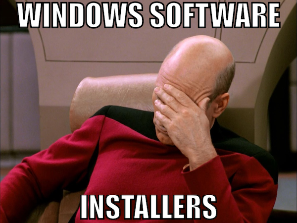

+++

@title[No Consistency]

### No Consistency

- Over 20 different installer formats and thousands of installers in the wild
- Zips and other archive formats
- Software installers are messy
- It's like the wild west

+++

@title[Wild West]

---

@title[Let's install paint.net]

## Let's install paint.net...

+++

@title[paint.net website]

<!-- .slide: data-transition="none" -->

+++

@title[Not the paint.net website]

<!-- .slide: data-transition="none" -->
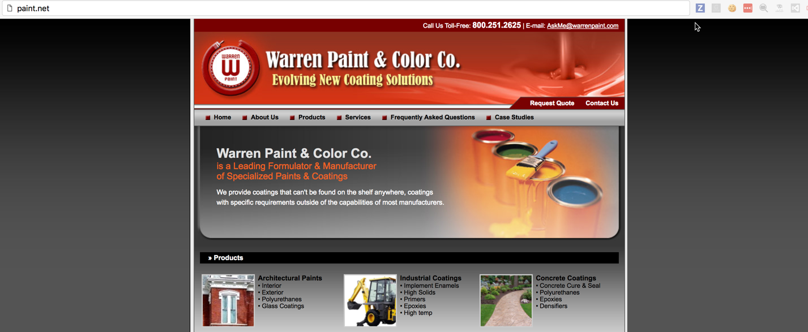

+++

@title[Google paint.net]

<!-- .slide: data-transition="none" -->
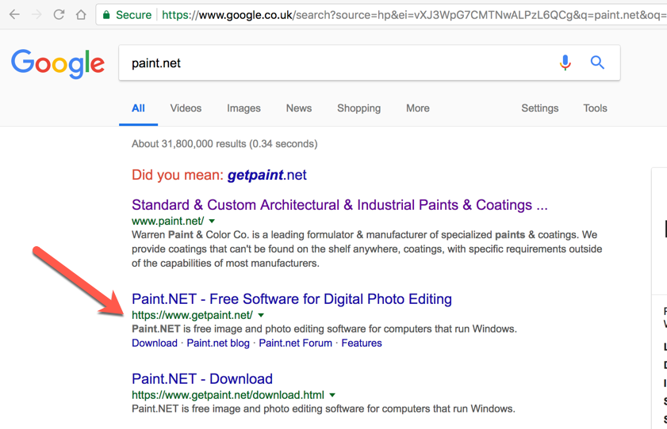

+++

@title[Actual paint.net website]

<!-- .slide: data-transition="none" -->
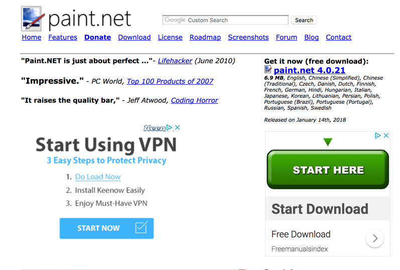

+++

@title[paint.net download]

<!-- .slide: data-transition="none" -->
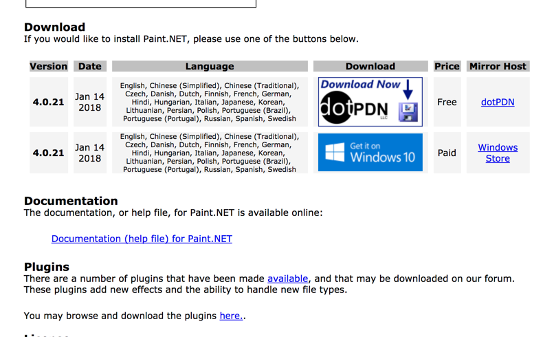

+++

@title[Mirror website]

<!-- .slide: data-transition="none" -->
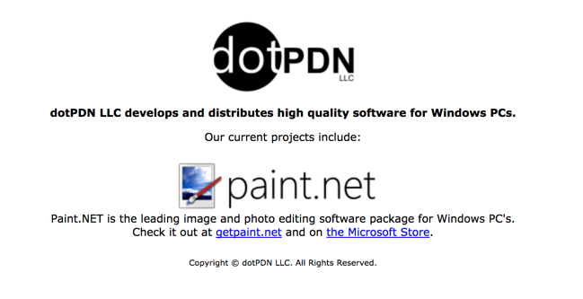

+++

@title[Actual paint.net download]

<!-- .slide: data-transition="none" -->
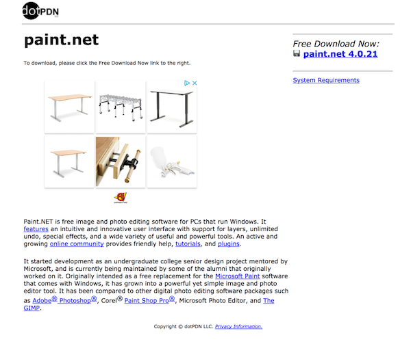

+++

@title[Unblock zip file]

<!-- .slide: data-transition="none" -->
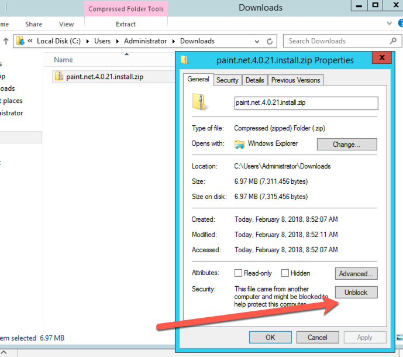

+++

@title[Extract zip file]

<!-- .slide: data-transition="none" -->
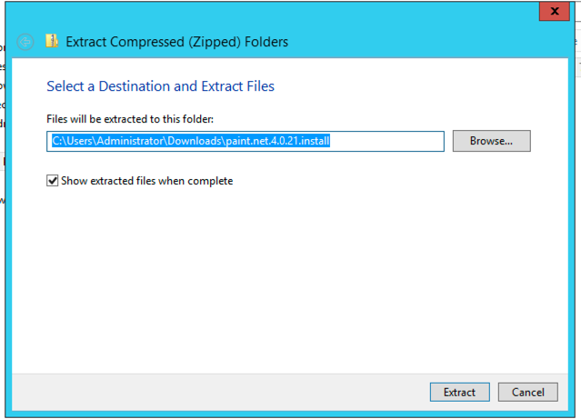

+++

@title[Install paint.net]

<!-- .slide: data-transition="none" -->
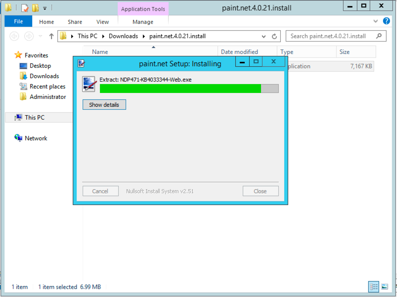

+++

@title[paint.net dependencies]

<!-- .slide: data-transition="none" -->
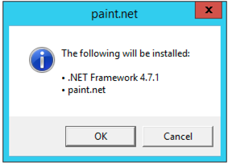

---

@title[There has to be a better way!]

## "There has to be a better way!"

+++

@title[Chocolatey]

### Let's add a layer of Chocolate(y)

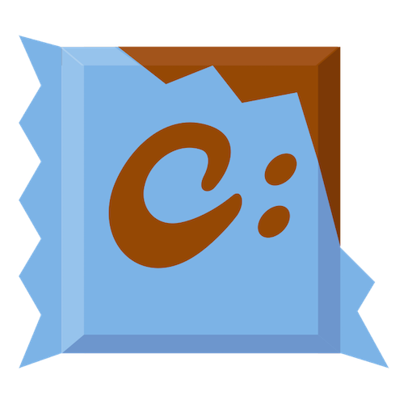

---

@title[Installing is easy...]

### Installing is easy...

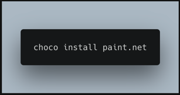

---

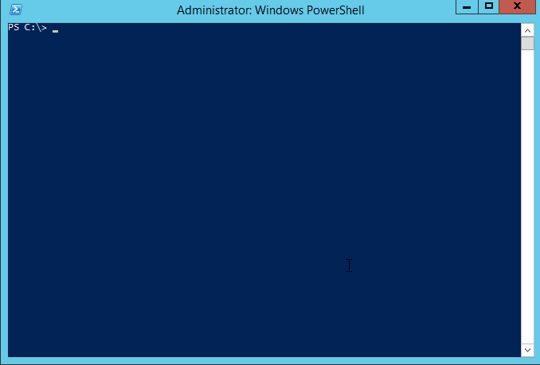

---

@title[Sane Software Management]

### Chocolatey - Sane Software Management

- Easily manage the software lifecycle
- Native installers, zips and binaries
- PowerShell Module simplifies work
- Packages are independent building blocks
- Integrates with Configuration Management
- Business Friendly Features

---

@title[The Approach]

### Chocolatey - The Approach

- Single, unifying interface - control the chaos
- Decentralized - mulitple places to get packages, including internal
- PowerShell
- Flexible
- Secure
- Reliable

---

@title[Community Package Repository]

### Community Package Repository

- [https://chocolatey.org/packages](https://chocolatey.org/packages)
- Community Feed / Community Maintained
- Moderated as of October 2014
- Everything goes through VirusTotal
- Organisations should NOT depend on this due to trust and control concerns

+++

@title[Community Repository Stats]

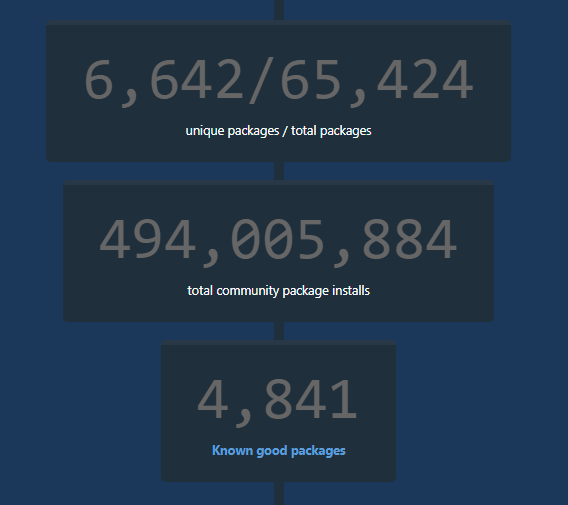

##### As of April 8th 2019

+++

@title[That is just the beginning...]

### That is just the beginning...

---

@title[Hosting your own package server]

### Hosting your own package server

- [https://chocolatey.org/docs/how-to-host-feed](https://chocolatey.org/docs/how-to-host-feed)
- Non-Windows Hosting
  - [Artifactory](https://youtu.be/rMivH0DS9q8)
  - [Sonatype Nexus](https://youtu.be/UehkG1VHtz0)
- NuGet Gallery
- ProGet / MyGet
- NuGet.Server / Chocolatey.Server

---

@title[Chocolatey Packages]

### Chocolatey Packages

- Zip files + Versioning, Dependencies & PowerShell
- Metadata; Software and Package Information
- PowerShell
  - 30+ Built-in functions - turn hard tasks into one-liners
  - Handle additional missing installer logic (like add to PATH)
  - Add options missing from installer arguments
- Files - drop in binaries / native installers

---

@title[Demos]

## Demos

Note:
Mention laptop setup:

---

@title[Only getting started...]

## Only getting started...

- choco upgrade all
- Package Downloader / Internalizer (Pro+)
- Sync with Programs and Features (Pro+ / C4B)
- Self Service Installer (C4B)
- Central Management UI / choco deploy (C4B)
- Package Audit (C4B)
- Package Reducer (Pro+)
- Install Directory Override (Pro+)
- Download CDN Cache (Pro+)
- Runtime Malware/Virus Protection (Pro+)

+++

## Possible sources

- Any Chocolatey Feed
- Public Gallery 
- Web Platforms Installer
- Windows Features
- Windows Updates
- Ruby Gems
- Cygwin
- Python

+++

## Other install methods

- Windows Feature
  - choco install [feature name] -source WindowsFeatures
  - e.g. TelnetClient
  - choco list --source WindowsFeatures
- Web Platform Source
  - choco install [package name] -source webpi
  - e.g. IISExpress
  - choco list --source webpi
  
+++

## Other install methods

- Other
  - choco install [package name] -source ruby
  - choco install [package name] -source cygwin
  - choco install [package name] -source python

---

### Oh my... Command line?

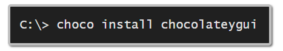

+++

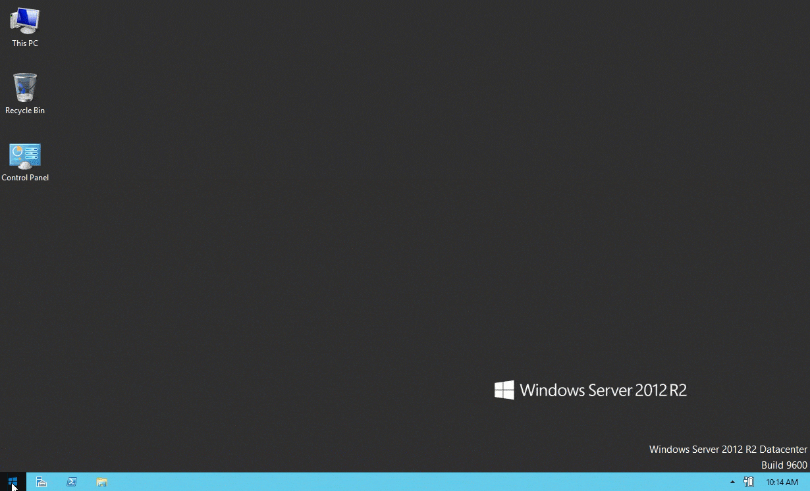

---

@title[Slides and Code]

## Slides

##### https://gitpitch.com/mkevenaar/ChocolateyIntroduction/INFO

## Code

##### https://git.io/fjqJ1

---

@title[Questions]

## If you have any questions, feel free to get in touch

---

@title[Thanks]

